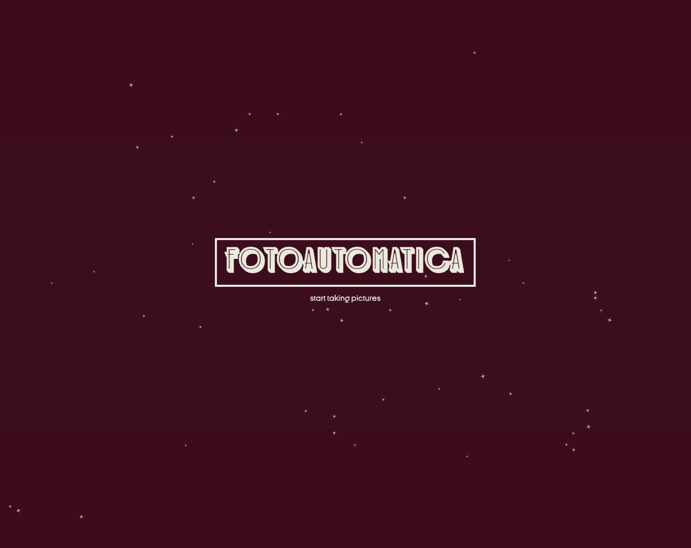
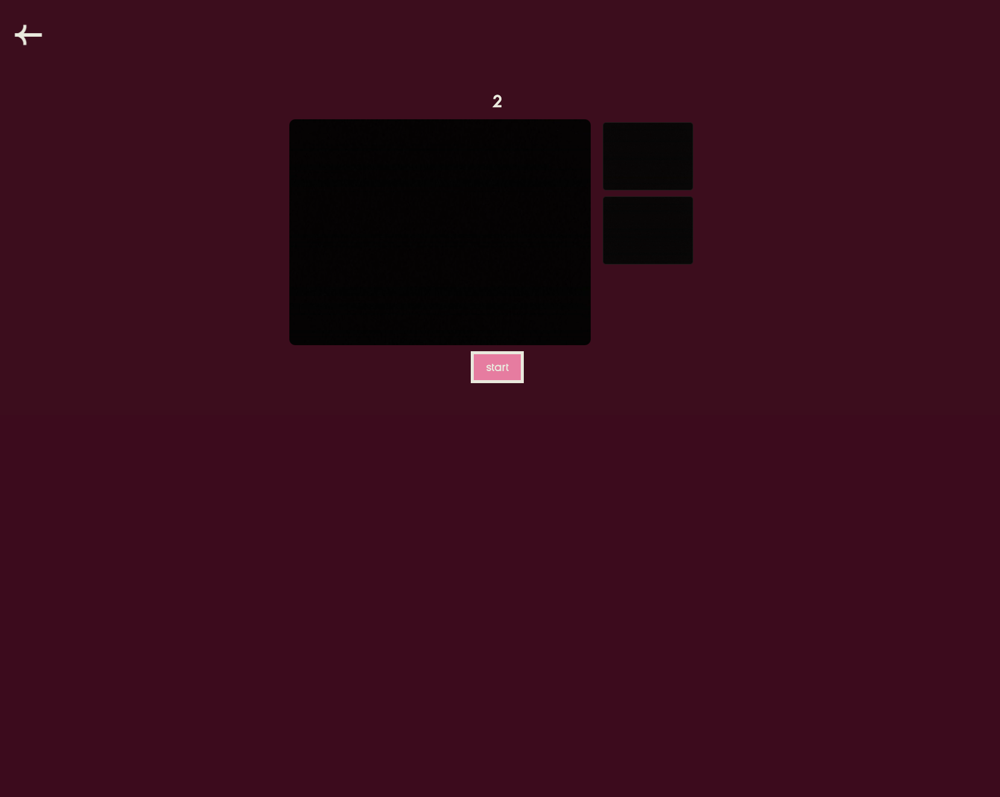
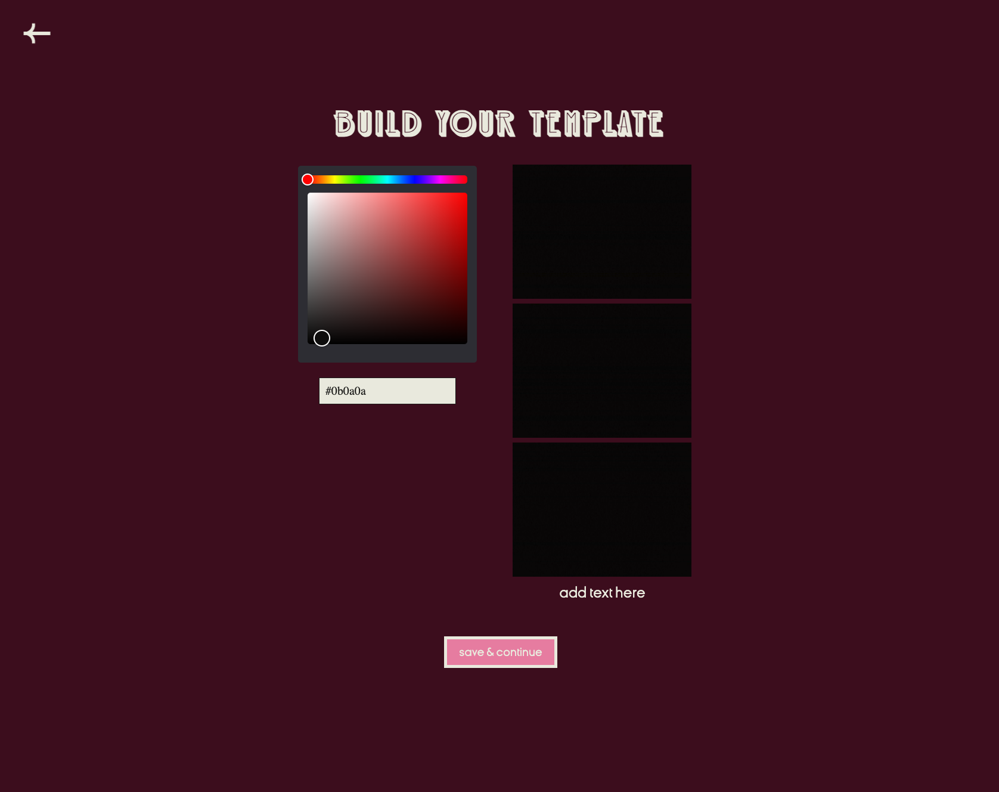
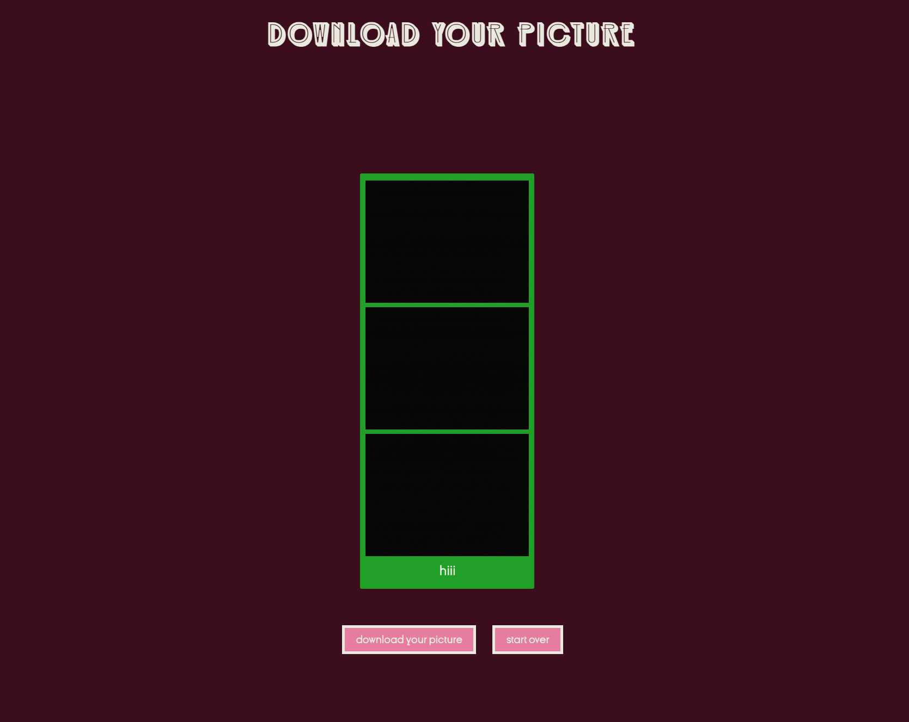
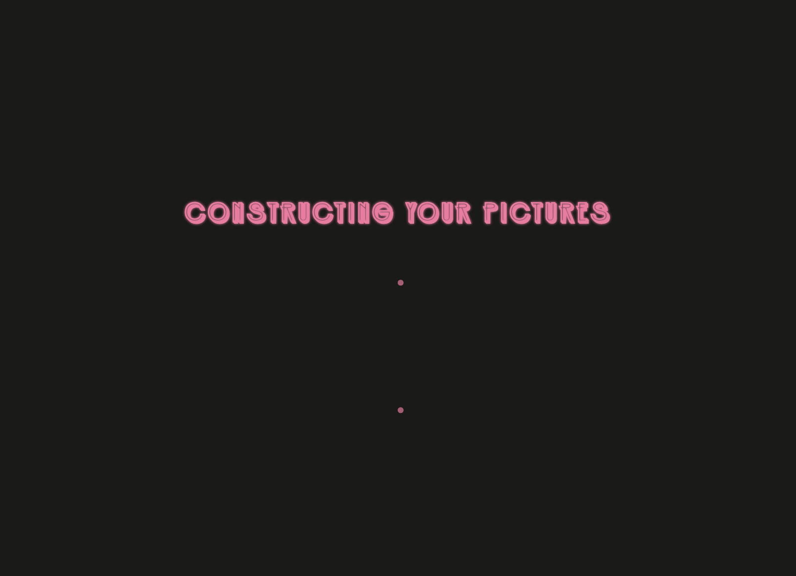
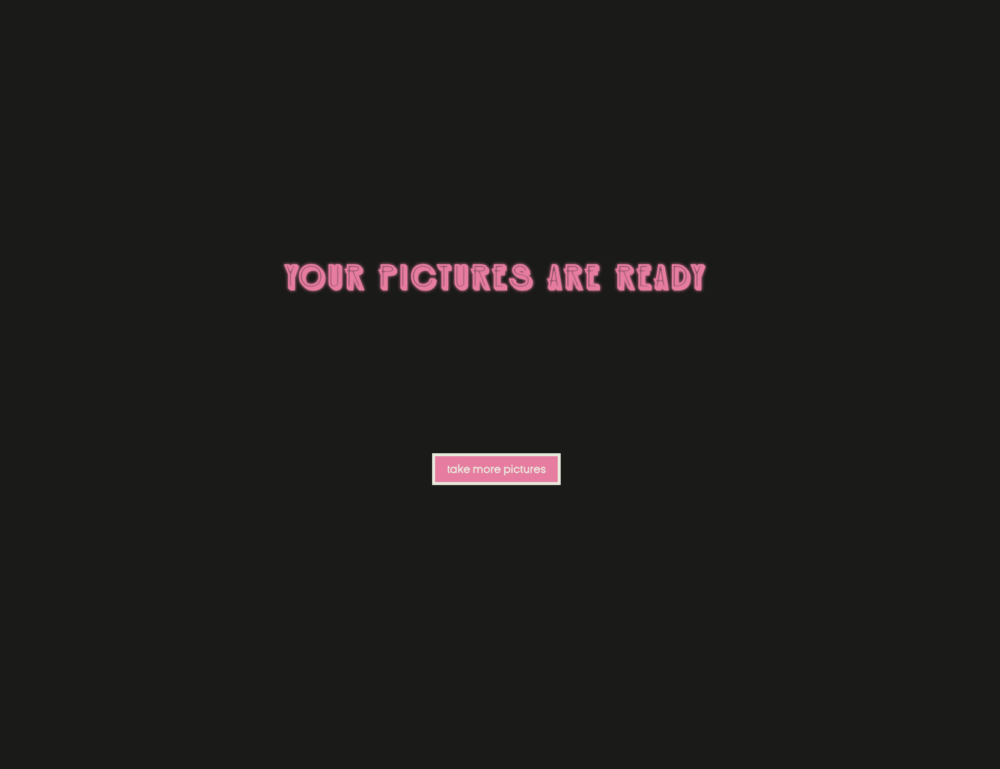

# Photobooth app

### Fotoautomatica is a digital photobooth reimagined for your phone. Inspired by a charming analog booth I stumbled upon in a hotel in Old San Juan, I wanted to bring that nostalgia into a more modern, pocket-sized twist. You can take classic photo strips, pick your own background colour, and download your pictures. The interface blends retro-futuristic with Y2K inspired graphics.









# 🛠️ set-up

1. Install dependencies

```bash
npm install
```

2. Start development server

```bash
npm run dev
```
